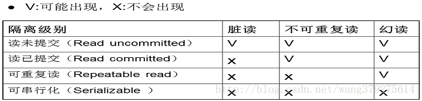

## 形成原因：
> java多线程并发导致读取数据时出现了一些问题：
- 脏读:一个事务读取了另一个未提交的并行事务写的数据
- 不可重复读:一个事务重新读取前面读取过的数据， 发现该数据已经被另一个已提交的事务修改过
- 幻读:一个事务重新执行一个查询，返回一套符合查询条件的行， 发现这些行因为其他最近提交的事务而发生了改变

## 事物隔离级别
- 读未提交（Read uncommitted）
- 读已提交（Readcommitted）
- 可重复读（Repeatableread）
- 可串行化（Serializable）

## 隔离级别与问题对应关系

